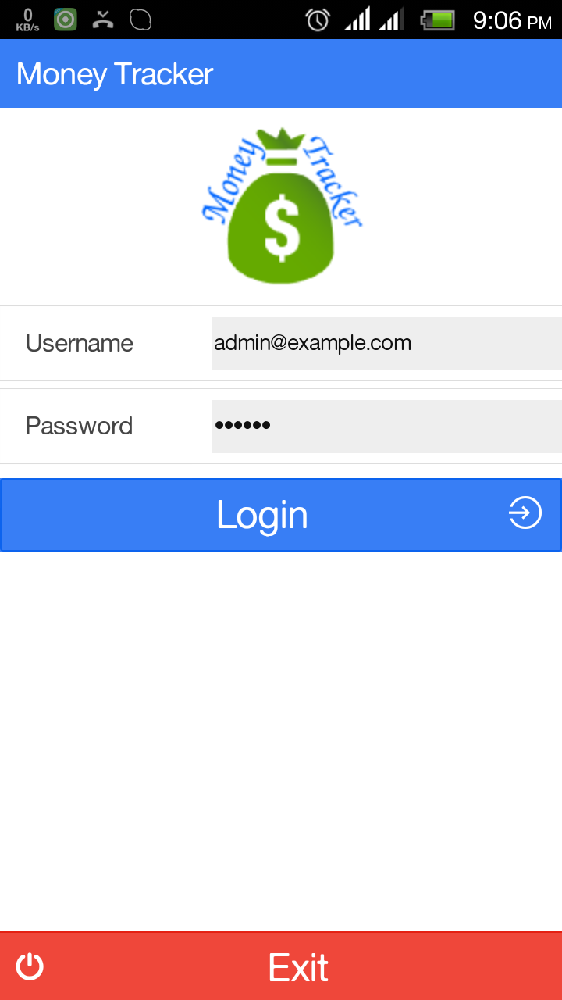
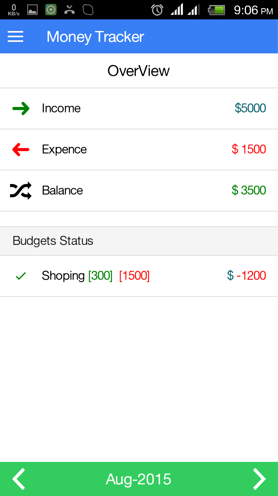
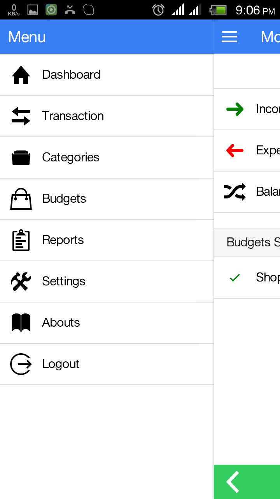
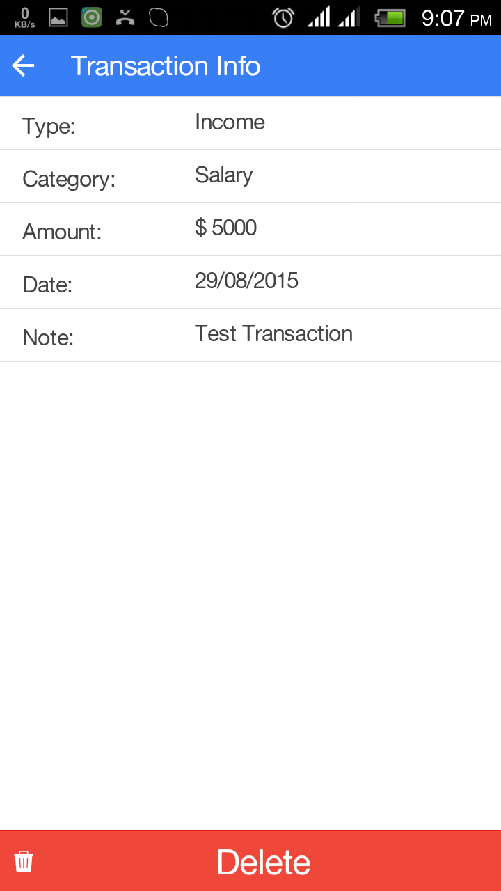
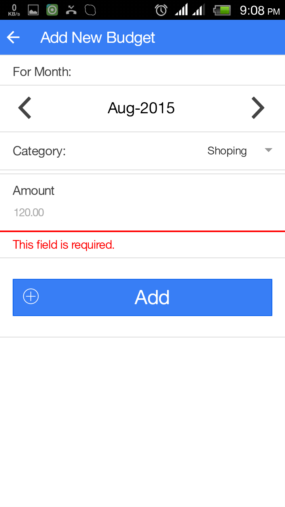
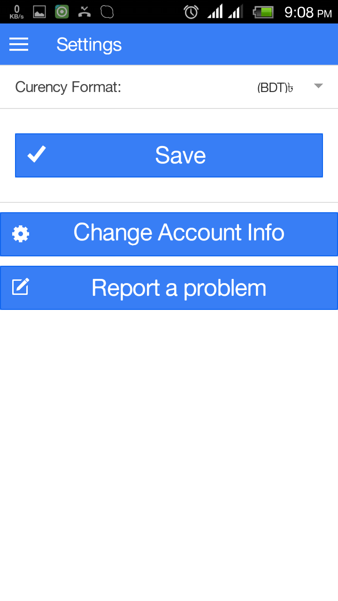
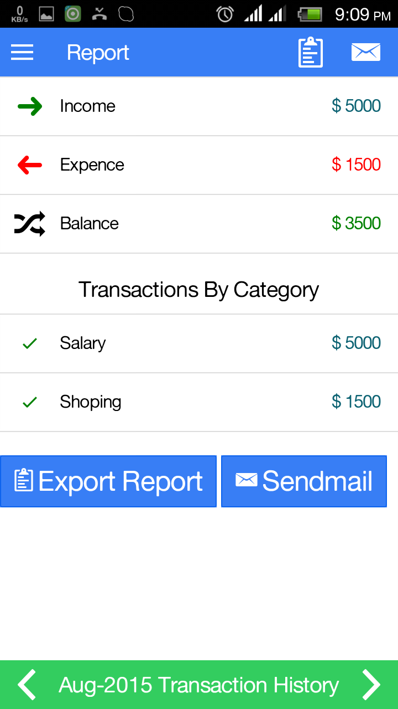

# moneyTracker
Personal Finance manage native mobile application Using Cordova.

Usage:
=====

First, install "Node.js and npm". Then, install the latest Cordova and Ionic command-line tools. 

$ npm install -g cordova ionic

Follow the <a href="http://cordova.apache.org/docs/en/3.3.0/guide_platforms_android_index.md.html#Android%20Platform%20Guide" target="_blank">Android</a> and <a href="http://cordova.apache.org/docs/en/3.3.0/guide_platforms_ios_index.md.html#iOS%20Platform%20Guide" target="_blank"> iOS </a> platform guides to install required platform dependencies.

Then Go to application direcotry

$ cd moneyTracker
$ ionic platform add android
$ ionic build android
$ ionic run android

Screenshots:
===========

Need More Help?
---------------
Email: root[AT]hrshadhin[DOT]me

